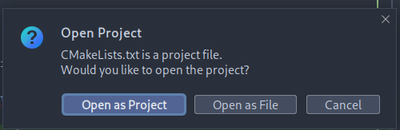

# TRLBot

### A discord bot designed to assist in Triton Rocket League community tournaments.

#### System Requirements
- Ubuntu 22.04 LTS 64-bit

## Setup and Testing Locally with QEMU (aarch64)

__Required Packages:__

```shell
sudo apt install                    \  
   qemu-user                        \  
   qemu-user-static                 \  
   gcc-aarch64-linux-gnu            \  
   g++-aarch64-linux-gnu            \  
   binutils-aarch64-linux-gnu       \  
   binutils-aarch64-linux-gnu-dbg   \
   cmake                            \
   ninja-build                      \
   build-essential  
```

1. Clone this repo **recursively**:

```shell
git clone --recursive https://github.com/ankbhatia19/TRLBot.git
```


2. Locate CMakeLists.txt using IDE of choice (I am using CLion).

   Alternatively, skip to step 5 for CLI instructions.


4. Ensure to select 'Open as Project'



5. Create a `config.json` file:
```shell
touch config.json
```
**For security reasons, the `config.json` file will not be hosted on Git.**


6. Most IDE's will have features to automatically configure and build the CMake project. Alternatively, the CLI can be used
to do these steps manually, as follows:

- CMake configuration (Should only be done once per project or when any CMakelists is edited):
```shell
cd ~/.../TRLBot
mkdir cmake-build-debug
cmake -S . -B cmake-build-debug -GNinja
```

- Building executable:

```shell
cmake --build cmake-build-debug/ --target TRLBot -j $(nproc)
```

8. Run executable using your IDE or via CLI:

```shell
qemu-aarch64 cmake-build-debug/TRLBot
```

**Note that executable will promptly fail without the necessary `config.json`. Please reach out to the developer for
this file.**